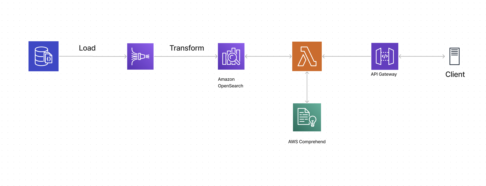

# opply-nlp

- Develop an algorithm that identifies the most relevant suppliers for the request by e.g. ranking the website content by relevance. 
Please add a readme file to describe your approach and provide a list of the results.
- Please describe which AWS or GCP resources you would use to build a production-ready pipeline for your approach.
- Please describe how you would improve your algorithm if you had more time and / or resources available.e describe how you would improve your algorithm if you had more time and / or resources available.

## Algorithm
I haven't done this work before, so I am not well versed on the topic. But I believe it would fall in the domain of semantic similarity. I have found
[txtai](https://neuml.github.io/txtai/) to be a well documented semantic search library that we can use for this type of problem. Other
options may be [spaCy](https://spacy.io/) or [NLTK](https://www.nltk.org/). I went with txtai as there were ample examples and I could find 
what I needed easily. 

### Method
The approach I took is really simple. For each seller, I compute the [similarity scores](https://neuml.github.io/txtai/pipeline/text/similarity/) between the subpages 
and the query. I record the subpage with the highest similarity score. Once, we have retrieved the similarity scores between the query
and the best match for each website, I sort the scores in descending order and get the top n (set to 5) results. 

### Results
Unfortunately, the above method is way too slow as it tokenizes it on the fly.
I also don't have the time to run it nor improve it, so unfortunately I can't provide any results.

### Recommendations
Obviously, the implementation is not even remotely close to being production ready - and its quality may be questionable. 
Given more time, I'd recommend the following improvements:
1. It is very hard to test the algorithm when the tokenization takes up a lot of time. It'd be much better to tokenize and index the corpus first, 
such that only the query needs to be tokenized at runtime. 
   1. We can shard the index for more efficient searching: https://github.com/neuml/txtai/blob/master/examples/15_Distributed_embeddings_cluster.ipynb
2. Feature engineering and data cleaning:
   1. Nearly all websites contain subpages that may not be really relevant to what we are trying to do. We can likely achieve better result
   if we can preprocess the data by e.g. removing unnecessary subpages, or adding tags and labels to the website. 
   2. We can include images in our dataset - it may be helpful in improving our ranking (if for example we always expect a picture of almonds for such a query)
   3. We can further clean up the body of text by removing stop words and words that are very common (e.g. the, and). 
3. We can try out different pre-trained models. Some may work better than others for our use case.
4. For continuous improvement we can include a "thumbs up" or "thumbs down" button such that users can rank the relevancy of the matches, and we can use this to find ways to further improve the matches.

## Potential design of a production grade system
I am not intimately familiar with most of the AWS Services. (There seems to be a new one every month)
So this is simply a best guess without going into the specifics of each service. 

1. AWS API Gateway to form a RESTful API
2. AWS Lambda as a microservice to manage the preprocessing and accessing AWS Opensearch
3. AWS Comprehend for parsing the query, extracting features
   1. Alternatively we can substitute Sagemaker for custom NLP models, if AWS Comprehend doesn't have the necessary features for our use-case
4. AWS Opensearch for indexing and searching documents
5. AWS Firehose to stream and transform crawled data to AWS Opensearch

An alternative to the above solution could be one that is more bespoke, e.g. one that is running on a few EC2 instances. For example, we could run one or more 
EC2 instances (sharded) on which the index runs which can then be queried via an endpoint. This would require more infrastructure management on our end, but allow for more
customization. 